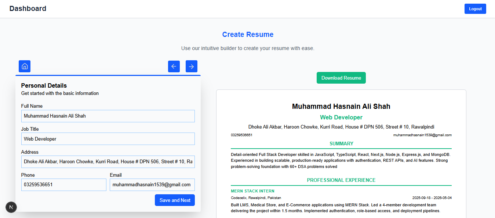
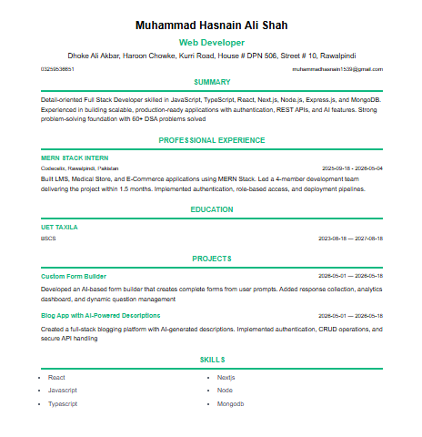
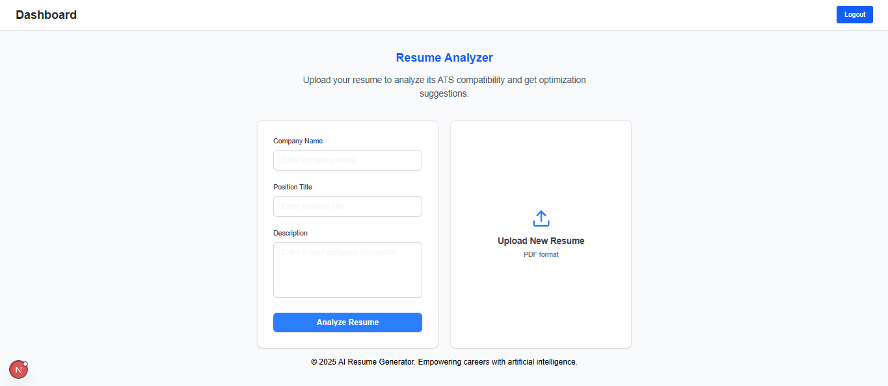
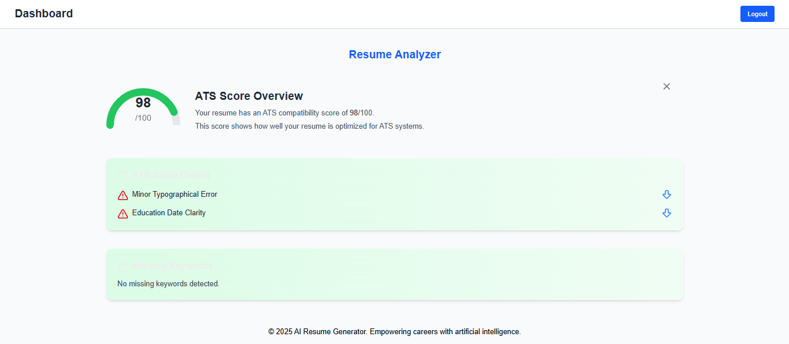

# 📄 Resume Analyzer & Builder
## 🚀 Overview

Resume Analyzer & Builder is a web application that helps users create professional resumes and analyze them against job descriptions. It provides an ATS (Applicant Tracking System) score, improvement suggestions, and real-time resume building with live preview.

## ✨ Features
### 🧠 Resume Analyzer
- ATS compatibility score (0–100)
- Job description vs resume keyword matching
- Missing skills detection
- Improvement suggestions (AI-based or rule-based)
- Section-wise analysis (Skills, Experience, Projects)
### 🛠 Resume Builder
- Easy form-based resume creation
- Live preview of resume
#### Multiple sections support:
- Personal Info
- Skills
- Experience
- Projects
- Education
### 📊 Smart Insights
- Weak bullet point detection
- Missing keywords from job description

### 🏗 Tech Stack
- Next.js
- Tailwind CSS
- Zustand
- Next-auth
- Framer-motion
- Axios
- puppeteer
- react-toastify
- Lucide-react
- react-pdftotext

### AI / Logic:

- Keyword matching / NLP
- Gemini
  #### ⚙️ How It Works
  - User creates or uploads resume
  - User pastes job description
  - System compares resume with JD
  - ATS score is generated
  - Suggestions are shown to improve resume
  - User can edit and optimize resume in real time
📸 Screenshots (add later)

## IMAGES

#### Resume Builder UI

#### Resume Generated by it

#### ATS INPUT Page

#### Analysis Report

## 📄 License

MIT License

👨‍💻 Author

M HASNAIN ALI SHAH

MERN Stack Developer

GITHUB: [GitHub Repo](https://github.com/MUHAMMAD-HASNAIN-ALI-SHAH/ai-resume-analyzer-and-builder.git)

MY Portfolio: [GitHub Repo](https://mhasnainalishah.vercel.app/)

LIVE DEMO LINK: [LIVE DEMO](https://resume-werse.vercel.app/) 